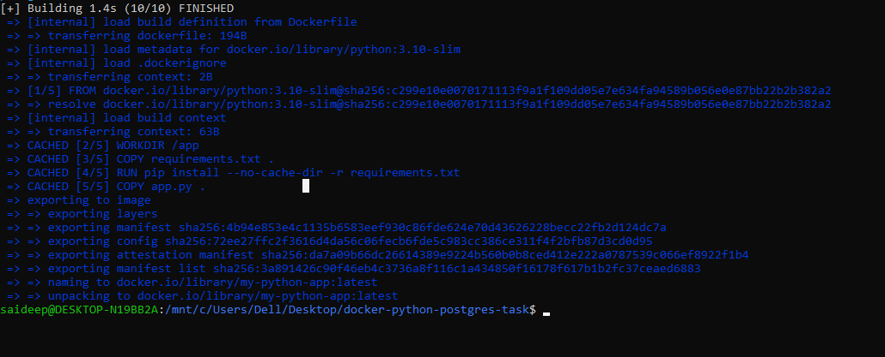
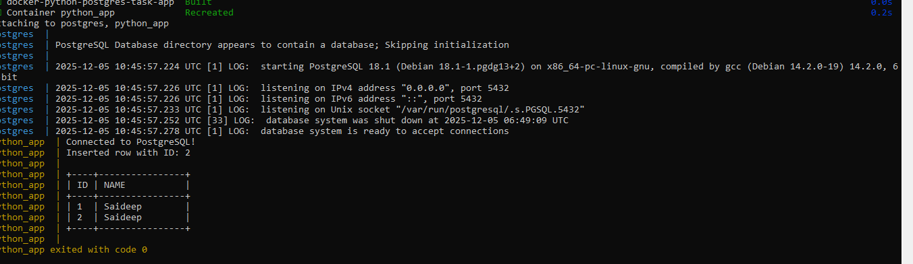
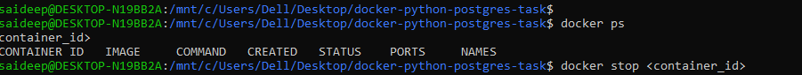

 <h1> Dockerized Python + PostgreSQL Mini Project</h1>

A beginner-friendly DevOps project demonstrating multi-container Docker orchestration.

<h2>Project Overview</h2>

<h3>1. What does this project do?</h3>
<ul>
  <li>Runs a Python application inside a Docker container</li>
  <li>Runs a PostgreSQL database in another container</li>
  <li>Connects both services using a custom Docker network</li>
  <li>Python app creates a table, inserts data, reads data, and prints it in box-style format</li>
</ul>

<h3>2. Why is it useful?</h3>
<ul>
  <li>Teaches real DevOps multi-container setup</li>
  <li>Shows how applications communicate inside Docker networks</li>
  <li>Demonstrates Docker Compose and service orchestration</li>
  <li>Helps understand Python-to-database integration</li>
</ul>

<h2>B. How to Use the Project</h2>

<h3>1 Installation Steps</h3>

Run this inside your project folder:

<pre><code class="bash">
docker compose up --build
</code></pre>

###   Screenshot 1

This automatically:

<ul>
  <li>Creates a custom Docker network</li>
  <li>Starts PostgreSQL</li>
  <li>Starts the Python app</li>
  <li>Performs all database operations</li>
</ul>

<h3>2 Basic Usage Commands</h3>

<b> Start the project</b>
<pre><code class="bash">
docker compose up --build
</code></pre>

<b>Stop the project</b>
<pre><code class="bash">
docker compose down
</code></pre>

<b> Reset the database (delete all data)</b>
<pre><code class="bash">
docker compose down -v
</code></pre>

<h2>C. Project Folder Structure</h2>

<pre><code>
docker-python-postgres-task/
├── app.py
├── Dockerfile
├── requirements.txt
└── docker-compose.yml
└── screenshots

</code></pre>

<h2> How It Works</h2>

<h3>1. Application Workflow</h3>
<ul>
  <li>Docker Compose launches PostgreSQL and Python containers</li>
  <li>Python app waits 5 seconds for PostgreSQL to start</li>
  <li>Connects using psycopg2</li>
  <li>Creates <b>students</b> table</li>
  <li>Inserts one row</li>
  <li>Fetches and prints rows in box-style output</li>
</ul>

<h3>2. Docker Networking</h3>

Both containers run on a custom network:

<pre><code>
mynetwork
</code></pre>

Python connects using:

<pre><code>
host = "postgres"
</code></pre>

<h3>3. Why this setup?</h3>

<ul>
  <li>Represents real DevOps multi-container architecture</li>
  <li>Demonstrates service dependencies</li>
  <li>Automatically manages startup order</li>
  <li>Shows microservice-style container communication</li>
</ul>

<h2>Testing</h2>

<h3>1. What was tested?</h3>
<ul>
  <li>PostgreSQL startup</li>
  <li>Python-to-PostgreSQL connection</li>
  <li>Table creation</li>
  <li>Insert and read operations</li>
  <li>Resetting database</li>
</ul>

<h3>2. Example Output</h3>

<pre><code>
Connected to PostgreSQL!
Inserted row with ID: 1

+----+----------------+
| ID | NAME           |
+----+----------------+
| 1  | Saideep        |
+----+----------------+
</code></pre>

###   Screenshot 2

<h2> Demonstrations</h2>

<b>Start the project:</b>
<pre><code class="bash">
docker compose up --build
</code></pre>

<b>Stop the project:</b>
<pre><code class="bash">
docker compose down
</code></pre>

<b>View logs in Docker Desktop:</b>
<ul>
  <li>python_app → Logs</li>
  <li>postgres → Logs</li>
</ul>

###  Logs Screenshot

<b>Reset database:</b>
<pre><code class="bash">
docker compose down -v
</code></pre>

<h2> Sample Logs</h2>

<pre><code>
Connected to PostgreSQL!
Inserted row with ID: 2

+----+----------------+
| ID | NAME           |
+----+----------------+
| 1  | Saideep        |
| 2  | Saideep        |
+----+----------------+
</code></pre>

<h2> Final Learning & Reflection</h2>

<ul>
  <li>Understood multi-container orchestration</li>
  <li>Learned Docker networks & service communication</li>
  <li>Improved debugging skills inside Docker</li>
  <li>Learned Python–PostgreSQL integration</li>
  <li>Improved understanding of DevOps project structure</li>
</ul>

This project builds a strong foundation for future skills: Kubernetes, CI/CD, microservices, and cloud deployments.

<h2>Author</h2>

<b>Saideep</b> Beginner DevOps Engineer Passionate about Docker, automation, and cloud 

